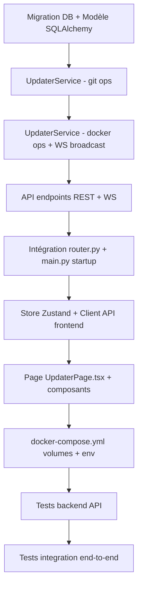

# Auto-Update System — Architecture Document

> **Statut** : Proposition d'architecture — v1.0  
> **Date** : 2026-03-03  
> **Auteur** : Kilo Code (Architect mode)

---

## Table des matières

1. [Vue d'ensemble](#1-vue-densemble)
2. [Décision d'architecture : où faire tourner le service](#2-décision-darchitecture)
3. [Schéma de la base de données](#3-schéma-de-la-base-de-données)
4. [API endpoints](#4-api-endpoints)
5. [Modèle de données frontend — Store Zustand](#5-modèle-de-données-frontend--store-zustand)
6. [Flux de données complet](#6-flux-de-données-complet)
7. [Stratégie de rollback](#7-stratégie-de-rollback)
8. [Variables d'environnement](#8-variables-denvironnement)
9. [Intégration docker-compose](#9-intégration-docker-compose)
10. [Structure des fichiers à créer/modifier](#10-structure-des-fichiers-à-créermodifier)

---

## 1. Vue d'ensemble

### 1.1 Diagramme de haut niveau

```
┌─────────────────────────────────────────────────────────────────────────┐
│                          DOCKER HOST                                    │
│                                                                         │
│  ┌──────────────────────────────────────────────────────────────────┐  │
│  │  docker-compose stack                                            │  │
│  │                                                                  │  │
│  │  ┌──────────────┐    REST/WS     ┌──────────────────────────┐   │  │
│  │  │  Frontend    │◄──────────────►│  Backend FastAPI         │   │  │
│  │  │  React+TS    │                │  /api/v1/updater/...      │   │  │
│  │  │  /updater    │                │                          │   │  │
│  │  └──────────────┘                │  ┌────────────────────┐  │   │  │
│  │                                  │  │  UpdaterService    │  │   │  │
│  │                                  │  │  - git poll loop   │  │   │  │
│  │                                  │  │  - asyncio task    │  │   │  │
│  │                                  │  │  - Docker SDK      │  │   │  │
│  │                                  │  └────────┬───────────┘  │   │  │
│  │                                  └───────────┼──────────────┘   │  │
│  │                                              │                   │  │
│  │  ┌──────────────────────────────────────┐    │                   │  │
│  │  │  PostgreSQL                          │    │ docker.sock       │  │
│  │  │  table: deployment_history           │◄───┘ (volume mount)   │  │
│  │  └──────────────────────────────────────┘                       │  │
│  │                                                                  │  │
│  └──────────────────────────────────────────────────────────────────┘  │
│                                                                         │
│  /var/run/docker.sock  ──────────────────────────────────────────────► │
│  (accès Docker Engine depuis le container backend)                      │
└─────────────────────────────────────────────────────────────────────────┘
```

### 1.2 Cycle de vie d'une mise à jour

```
idle ──► fetching ──► [no changes] ──► idle
           │
           ▼ (nouveau commit détecté)
         pulling
           │
           ▼
         building  (docker build, logs streamés via WS)
           │
           ├─► [build failed] ──► error ──► rollback ──► idle
           │
           ▼
         deploying  (stop gracieux ancien container, start nouveau)
           │
           ├─► [deploy failed] ──► error ──► rollback ──► idle
           │
           ▼
         success ──► idle
```

---

## 2. Décision d'architecture

### 2.1 Options envisagées

| Option | Description | Avantages | Inconvénients |
|--------|-------------|-----------|---------------|
| **A — Module dans le backend FastAPI existant** | `UpdaterService` ajouté dans `backend/app/services/` ; endpoint `/api/v1/updater/` monté dans `router.py` | Pas de service supplémentaire, réutilise la DB PostgreSQL existante, partage les dépendances Python, pattern WS identique à `training.py` | Responsabilité mixte dans un seul process ; le backend se redémarre lui-même (complexité) |
| **B — Service Docker séparé** | Micro-service Python autonome (`updater/`) avec sa propre image, accès socket `/var/run/docker.sock`, Redis pour la communication inter-services | Isolation totale, peut redémarrer le backend sans s'affecter lui-même | Nouveau Dockerfile, nouvelle DB ou accès partagé, sur-engineering pour ce besoin |
| **C — Script externe + webhook** | Cron ou webhook GitHub Actions déclenche un script sur l'hôte | Simple | Aucune UI temps réel, aucune intégration avec le backend SignFlow |

### 2.2 Décision retenue : **Option A — Module dans le backend FastAPI**

**Justification :**

1. **Pattern existant** : `training.py` montre exactement comment orchestrer un job long avec WebSocket live dans FastAPI. Le système d'update suit le même pattern.
2. **DB partagée** : la table `deployment_history` utilise directement SQLAlchemy + la DB PostgreSQL existante, sans configuration supplémentaire.
3. **Alembic** : la migration s'intègre naturellement dans `backend/alembic/versions/`.
4. **Simplicité opérationnelle** : un seul service `backend` à gérer dans le `docker-compose.yml`.
5. **Redémarrage du backend** : le point délicat est que le backend doit se redémarrer lui-même. La solution est d'utiliser une **tâche asyncio** qui lance `docker compose up --build --no-deps backend` via `subprocess` **après** avoir envoyé la réponse HTTP, sans attendre la fin. Le process restant en vie pendant le build, c'est le Docker Engine (externe) qui effectue le redémarrage — pas le process Python lui-même.

---

## 3. Schéma de la base de données

### 3.1 Table `deployment_history`

```sql
CREATE TABLE deployment_history (
    id              SERIAL PRIMARY KEY,
    triggered_by    VARCHAR(20) NOT NULL DEFAULT 'auto',
                    -- 'auto' | 'manual'
    status          VARCHAR(20) NOT NULL DEFAULT 'pending',
                    -- 'pending' | 'fetching' | 'pulling' | 'building'
                    -- | 'deploying' | 'success' | 'error' | 'rolled_back'
    commit_hash     VARCHAR(40),
    commit_message  TEXT,
    commit_author   VARCHAR(200),
    committed_at    TIMESTAMPTZ,
    previous_commit_hash  VARCHAR(40),
    build_log       TEXT,
    error_message   TEXT,
    build_duration_s      FLOAT,
    deploy_duration_s     FLOAT,
    total_duration_s      FLOAT,
    rollback_of_id  INTEGER REFERENCES deployment_history(id),
    created_at      TIMESTAMPTZ NOT NULL DEFAULT NOW(),
    started_at      TIMESTAMPTZ,
    completed_at    TIMESTAMPTZ
);

CREATE INDEX ix_deployment_history_status ON deployment_history(status);
CREATE INDEX ix_deployment_history_created_at ON deployment_history(created_at DESC);
```

### 3.2 Modèle SQLAlchemy

Fichier : [`backend/app/models/deployment.py`](../../backend/app/models/deployment.py)

```python
class DeploymentHistory(Base):
    __tablename__ = "deployment_history"

    id                   = Column(Integer, primary_key=True)
    triggered_by         = Column(String(20), nullable=False, default="auto")
    status               = Column(String(20), nullable=False, default="pending")
    commit_hash          = Column(String(40), nullable=True)
    commit_message       = Column(Text, nullable=True)
    commit_author        = Column(String(200), nullable=True)
    committed_at         = Column(DateTime(timezone=True), nullable=True)
    previous_commit_hash = Column(String(40), nullable=True)
    build_log            = Column(Text, nullable=True)
    error_message        = Column(Text, nullable=True)
    build_duration_s     = Column(Float, nullable=True)
    deploy_duration_s    = Column(Float, nullable=True)
    total_duration_s     = Column(Float, nullable=True)
    rollback_of_id       = Column(Integer, ForeignKey("deployment_history.id"), nullable=True)
    created_at           = Column(DateTime(timezone=True), server_default=func.now())
    started_at           = Column(DateTime(timezone=True), nullable=True)
    completed_at         = Column(DateTime(timezone=True), nullable=True)
```

---

## 4. API Endpoints

Base URL : `/api/v1/updater`

### 4.1 REST — État et contrôle

#### `GET /api/v1/updater/status`
Retourne l'état courant du service d'update et le dernier déploiement.

**Response 200 :**
```json
{
  "state": "idle",
  "current_deployment_id": null,
  "last_deployment": {
    "id": 12,
    "status": "success",
    "commit_hash": "abc1234",
    "commit_message": "feat: add new sign landmark model",
    "committed_at": "2026-03-03T15:00:00Z",
    "completed_at": "2026-03-03T15:04:32Z",
    "total_duration_s": 272.1
  },
  "git_remote_url": "https://github.com/org/signflow",
  "current_branch": "main",
  "local_head": "abc1234",
  "remote_head": "abc1234",
  "poll_interval_s": 60,
  "auto_update_enabled": true
}
```

#### `POST /api/v1/updater/trigger`
Déclenche un déploiement manuel immédiat.

**Request body :**
```json
{
  "force": false
}
```

**Response 202 :**
```json
{
  "deployment_id": 13,
  "message": "Deployment triggered"
}
```

**Erreur 409** si un déploiement est déjà en cours.

#### `POST /api/v1/updater/cancel`
Annule le déploiement en cours (seulement pendant les phases `fetching` ou `pulling`).

**Response 200 :**
```json
{
  "message": "Deployment cancelled"
}
```

#### `GET /api/v1/updater/history`
Liste l'historique paginé des déploiements.

**Query params :** `page=1`, `per_page=20`

**Response 200 :**
```json
{
  "items": [
    {
      "id": 13,
      "triggered_by": "manual",
      "status": "success",
      "commit_hash": "def5678",
      "commit_message": "fix: websocket reconnect logic",
      "commit_author": "Alice <alice@example.com>",
      "committed_at": "2026-03-03T16:00:00Z",
      "build_duration_s": 142.3,
      "deploy_duration_s": 18.7,
      "total_duration_s": 161.0,
      "created_at": "2026-03-03T16:05:00Z",
      "completed_at": "2026-03-03T16:07:41Z"
    }
  ],
  "total": 13,
  "page": 1,
  "per_page": 20
}
```

#### `GET /api/v1/updater/history/{deployment_id}`
Détail d'un déploiement avec log de build complet.

**Response 200 :**
```json
{
  "id": 13,
  "status": "success",
  "commit_hash": "def5678",
  "commit_message": "fix: websocket reconnect logic",
  "build_log": "Step 1/12 : FROM python:3.11-slim\n ...",
  "error_message": null,
  "rollback_of_id": null,
  "build_duration_s": 142.3,
  "deploy_duration_s": 18.7,
  "total_duration_s": 161.0
}
```

#### `POST /api/v1/updater/rollback/{deployment_id}`
Déclenche un rollback vers un déploiement spécifique.

**Response 202 :**
```json
{
  "deployment_id": 14,
  "rollback_of_id": 12,
  "message": "Rollback to commit abc1234 triggered"
}
```

#### `PATCH /api/v1/updater/settings`
Met à jour la configuration du polling.

**Request body :**
```json
{
  "auto_update_enabled": true,
  "poll_interval_s": 120
}
```

### 4.2 WebSocket — Streaming temps réel

#### `WS /api/v1/updater/live`
Flux temps réel de l'état du déploiement courant. Envoie un message toutes les 500ms quand un déploiement est actif, ou un heartbeat toutes les 5s en état `idle`.

**Messages émis par le serveur :**

```jsonc
// Heartbeat (idle)
{
  "type": "heartbeat",
  "state": "idle",
  "timestamp": "2026-03-03T16:10:00Z"
}

// Mise à jour de statut
{
  "type": "status_update",
  "deployment_id": 13,
  "state": "building",
  "progress_pct": 45,
  "commit_hash": "def5678",
  "commit_message": "fix: websocket reconnect logic",
  "elapsed_s": 64.2,
  "estimated_remaining_s": 78.0
}

// Ligne de log du build (streaming incrémental)
{
  "type": "build_log",
  "deployment_id": 13,
  "line": "Step 7/12 : RUN pip install -e .[dev]",
  "timestamp": "2026-03-03T16:06:15Z"
}

// Succès
{
  "type": "completed",
  "deployment_id": 13,
  "state": "success",
  "commit_hash": "def5678",
  "total_duration_s": 161.0
}

// Erreur
{
  "type": "error",
  "deployment_id": 13,
  "state": "error",
  "error_message": "Build failed: pip install returned exit code 1",
  "rollback_triggered": true
}

// Rollback
{
  "type": "rollback",
  "deployment_id": 14,
  "rollback_of_id": 12,
  "state": "deploying",
  "commit_hash": "abc1234"
}
```

**Messages reçus du client :**
```jsonc
// Ping de keepalive
{ "type": "ping" }
```

---

## 5. Modèle de données frontend — Store Zustand

Fichier : [`frontend/src/stores/updaterStore.ts`](../../frontend/src/stores/updaterStore.ts)

### 5.1 Types

```typescript
export type UpdaterState =
  | "idle"
  | "fetching"
  | "pulling"
  | "building"
  | "deploying"
  | "success"
  | "error"
  | "rolled_back";

export interface DeploymentSummary {
  id: number;
  triggeredBy: "auto" | "manual";
  status: UpdaterState;
  commitHash: string | null;
  commitMessage: string | null;
  commitAuthor: string | null;
  committedAt: string | null;
  buildDurationS: number | null;
  deployDurationS: number | null;
  totalDurationS: number | null;
  createdAt: string;
  completedAt: string | null;
  rollbackOfId: number | null;
}

export interface DeploymentDetail extends DeploymentSummary {
  buildLog: string | null;
  errorMessage: string | null;
  previousCommitHash: string | null;
}

export interface UpdaterStatus {
  state: UpdaterState;
  currentDeploymentId: number | null;
  lastDeployment: DeploymentSummary | null;
  gitRemoteUrl: string;
  currentBranch: string;
  localHead: string | null;
  remoteHead: string | null;
  pollIntervalS: number;
  autoUpdateEnabled: boolean;
}

export interface UpdaterStore {
  // État courant
  status: UpdaterStatus | null;
  currentState: UpdaterState;
  progressPct: number;
  elapsedS: number;
  estimatedRemainingS: number | null;
  buildLogLines: string[];

  // Historique
  history: DeploymentSummary[];
  historyTotal: number;
  historyPage: number;
  selectedDeployment: DeploymentDetail | null;

  // UI
  isLoading: boolean;
  error: string | null;
  wsConnected: boolean;

  // Actions
  fetchStatus: () => Promise<void>;
  triggerUpdate: (force?: boolean) => Promise<void>;
  cancelUpdate: () => Promise<void>;
  fetchHistory: (page?: number) => Promise<void>;
  fetchDeploymentDetail: (id: number) => Promise<void>;
  triggerRollback: (deploymentId: number) => Promise<void>;
  updateSettings: (settings: Partial<{ autoUpdateEnabled: boolean; pollIntervalS: number }>) => Promise<void>;
  connectWs: () => void;
  disconnectWs: () => void;
  clearBuildLog: () => void;
}
```

### 5.2 Client API

Fichier : [`frontend/src/api/updater.ts`](../../frontend/src/api/updater.ts)

```typescript
import { apiClient } from "./client";

export const updaterApi = {
  getStatus: () => apiClient.get<UpdaterStatus>("/updater/status"),
  trigger: (force = false) => apiClient.post<{ deployment_id: number }>("/updater/trigger", { force }),
  cancel: () => apiClient.post("/updater/cancel"),
  getHistory: (page = 1, perPage = 20) =>
    apiClient.get<{ items: DeploymentSummary[]; total: number }>(`/updater/history?page=${page}&per_page=${perPage}`),
  getDeploymentDetail: (id: number) => apiClient.get<DeploymentDetail>(`/updater/history/${id}`),
  rollback: (deploymentId: number) => apiClient.post(`/updater/rollback/${deploymentId}`),
  updateSettings: (settings: object) => apiClient.patch("/updater/settings", settings),
};
```

---

## 6. Flux de données complet

### 6.1 Diagramme de séquence — Poll automatique avec build

```
Scheduler                UpdaterService         Git Remote        Docker Engine        DB             WS Clients
(asyncio)                (backend)              (origin/main)     (/docker.sock)       (PostreSQL)    (UI)
    │                         │                       │                  │                  │              │
    │──poll tick (60s)────────►│                       │                  │                  │              │
    │                         │──git fetch ──────────►│                  │                  │              │
    │                         │◄── ok ────────────────│                  │                  │              │
    │                         │                       │                  │                  │              │
    │                         │── compare HEAD ────── ►│ (local only)    │                  │              │
    │                         │    local != remote     │                  │                  │              │
    │                         │                       │                  │                  │              │
    │                         │── INSERT deployment ──────────────────────────────────────► │              │
    │                         │   status=fetching     │                  │                  │              │
    │                         │──────────── broadcast status_update ──────────────────────────────────────►│
    │                         │                       │                  │                  │              │
    │                         │── git pull ──────────►│                  │                  │              │
    │                         │◄── ok ────────────────│                  │                  │              │
    │                         │── UPDATE status=building ─────────────────────────────────► │              │
    │                         │──────────── broadcast status_update ──────────────────────────────────────►│
    │                         │                       │                  │                  │              │
    │                         │── docker build ─────────────────────────►│                 │              │
    │                         │◄── log stream lines ──────────────────── │                 │              │
    │                         │──────────── broadcast build_log ───────────────────────────────────────── ►│
    │                         │                       │                  │                  │              │
    │                         │◄── build complete ─────────────────────── │                │              │
    │                         │── UPDATE status=deploying ───────────────────────────────► │              │
    │                         │──────────── broadcast status_update ──────────────────────────────────────►│
    │                         │                       │                  │                  │              │
    │                         │── docker stop --time 30 ────────────────►│                 │              │
    │                         │── docker start (new) ───────────────────►│                 │              │
    │                         │── healthcheck loop ─────────────────────►│                 │              │
    │                         │◄── /healthz 200 ───────────────────────── │                │              │
    │                         │── UPDATE status=success ────────────────────────────────── ►             │              │
    │                         │──────────── broadcast completed ──────────────────────────────────────────►│
    │                         │                       │                  │                  │              │
```

### 6.2 Logique de polling Git

```python
async def _poll_git(self) -> tuple[bool, str | None, str | None]:
    """
    Returns: (has_changes, local_head, remote_head)
    Exécute git fetch puis compare HEAD local vs origin/branch
    """
    # 1. git fetch --quiet
    result = await asyncio.create_subprocess_exec(
        "git", "fetch", "--quiet",
        cwd=self.repo_path,
        stdout=asyncio.subprocess.PIPE,
        stderr=asyncio.subprocess.PIPE,
    )
    await result.communicate()

    # 2. git rev-parse HEAD (local)
    local_proc = await asyncio.create_subprocess_exec(
        "git", "rev-parse", "HEAD",
        cwd=self.repo_path, stdout=asyncio.subprocess.PIPE
    )
    local_out, _ = await local_proc.communicate()
    local_head = local_out.decode().strip()

    # 3. git rev-parse @{u} ou origin/<branch> (remote tracking)
    remote_proc = await asyncio.create_subprocess_exec(
        "git", "rev-parse", f"origin/{self.branch}",
        cwd=self.repo_path, stdout=asyncio.subprocess.PIPE
    )
    remote_out, _ = await remote_proc.communicate()
    remote_head = remote_out.decode().strip()

    return (local_head != remote_head), local_head, remote_head
```

### 6.3 Zero-downtime deploy flow

```
1. docker build -t signflow_backend:new ./backend
   └── Logs streamés ligne par ligne via WS

2. docker stop --time 30 signflow_backend_1
   └── Graceful SIGTERM avec 30s pour finir les connexions WS en cours

3. docker rename signflow_backend_1 signflow_backend_old

4. docker run --name signflow_backend_1 ... signflow_backend:new
   └── Même config network/volumes que l'ancien container

5. Health check loop (max 60s) :
   GET http://localhost:8000/healthz → attendre HTTP 200

6. Si health check OK :
   └── docker rm signflow_backend_old
   └── docker rmi signflow_backend:previous (optionnel)

7. Si health check timeout :
   └── ROLLBACK automatique (voir §7)
```

**Note importante :** le process backend qui orchestre le deploy est différent du process backend qui est redémarré. L'`UpdaterService` tourne dans le container `backend` courant. Quand le nouveau container `backend` démarre, l'ancien peut encore vivre le temps du health check. Pour éviter les conflits de port, deux stratégies sont possibles :

- **Stratégie A (recommandée pour début)** : `docker compose up --build --no-deps --wait backend` — Docker Compose gère lui-même le remplacement du container. L'`UpdaterService` appelle simplement cette commande via `subprocess` et attend sa completion. Docker Compose fait l'arrêt de l'ancien et le démarrage du nouveau en séquence.
- **Stratégie B (zero-downtime strict)** : utiliser `docker compose up --build --no-deps --wait --scale backend=2` puis scale back à 1, avec un load balancer devant (Caddy supporte cette config). Complexité accrue, pour une phase ultérieure.

La **Stratégie A** est retenue pour la V1.

---

## 7. Stratégie de rollback

### 7.1 Rollback automatique (en cas d'échec)

Déclenché automatiquement si :
- Le build Docker retourne un exit code non nul
- Le health check ne passe pas dans les 60s post-démarrage
- Le déploiement Docker lui-même échoue

```python
async def _auto_rollback(self, deployment: DeploymentHistory, reason: str) -> None:
    """Rollback vers le commit précédent et crée une entrée d'historique."""
    rollback_entry = DeploymentHistory(
        triggered_by="auto",
        status="deploying",
        rollback_of_id=deployment.id,
        previous_commit_hash=deployment.commit_hash,
        commit_hash=deployment.previous_commit_hash,
    )
    db.add(rollback_entry)
    db.commit()

    # 1. git reset --hard <previous_commit_hash>
    await asyncio.create_subprocess_exec(
        "git", "reset", "--hard", deployment.previous_commit_hash,
        cwd=self.repo_path
    )

    # 2. docker compose up --build --no-deps --wait backend
    result = await asyncio.create_subprocess_exec(
        "docker", "compose", "up", "--build", "--no-deps", "--wait", "backend",
        cwd=self.project_path
    )
    await result.communicate()

    # 3. Mise à jour DB et broadcast WS
    rollback_entry.status = "rolled_back" if result.returncode == 0 else "error"
    rollback_entry.error_message = reason if result.returncode != 0 else None
    db.commit()
    await self._broadcast_ws({"type": "rollback", ...})
```

### 7.2 Rollback manuel (POST /api/v1/updater/rollback/{id})

L'utilisateur peut rollback vers n'importe quel déploiement `success` de l'historique :

1. Récupérer le `commit_hash` du déploiement cible
2. `git fetch && git reset --hard <commit_hash>`
3. `docker compose up --build --no-deps --wait backend`
4. Enregistrer en DB avec `rollback_of_id` → déploiement source
5. Broadcaster le résultat via WS

### 7.3 Conditions de garde

| Condition | Comportement |
|-----------|-------------|
| Plus de 3 rollbacks consécutifs | Stopper les tentatives, alerter via WS, passer en état `error` manuel |
| `previous_commit_hash` null | Impossible de rollback automatiquement, erreur explicite |
| Rollback d'un rollback | Autorisé (crée une chaîne de `rollback_of_id`) |

---

## 8. Variables d'environnement

À ajouter dans `.env.example` et la section `backend` du `docker-compose.yml` :

```bash
# ── Auto-Update System ────────────────────────────────────────────────────────

# Activer le polling automatique Git
UPDATER_ENABLED=true

# Chemin du dépôt Git à l'intérieur du container
# Monter le répertoire racine du projet en volume read-only
UPDATER_REPO_PATH=/repo

# Branche Git à surveiller
UPDATER_GIT_BRANCH=main

# Intervalle de polling en secondes (défaut : 60s)
UPDATER_POLL_INTERVAL_S=60

# Chemin du docker-compose.yml pour les commandes de build/deploy
UPDATER_COMPOSE_FILE=/repo/docker-compose.yml

# Nom du service à rebuilder (correspond au nom dans docker-compose.yml)
UPDATER_SERVICE_NAME=backend

# Timeout health check post-deploy en secondes
UPDATER_HEALTHCHECK_TIMEOUT_S=60

# Timeout arrêt gracieux du container en secondes (SIGTERM)
UPDATER_GRACEFUL_STOP_TIMEOUT_S=30

# Maximum de rollbacks automatiques consécutifs avant blocage
UPDATER_MAX_AUTO_ROLLBACKS=3

# Token GitHub/GitLab optionnel pour fetch sur dépôt privé (SSH ou HTTPS)
# Si SSH : monter la clé SSH en volume plutôt qu'utiliser un token
UPDATER_GIT_TOKEN=

# Nombre maximum d'entrées à conserver dans deployment_history
UPDATER_HISTORY_MAX_ENTRIES=100
```

### 8.1 Informations sensibles

- `UPDATER_GIT_TOKEN` ne doit **jamais** apparaître dans les logs. Utiliser une variable d'environnement séparée et ne pas la logger.
- Pour les dépôts privés SSH, monter `~/.ssh/id_ed25519` en volume read-only dans le container `backend`.

---

## 9. Intégration docker-compose

### 9.1 Volumes nécessaires

Le service `UpdaterService` doit pouvoir :
1. Lire/écrire dans le dépôt Git (pour `git pull`, `git reset`) → **volume bind mount du répertoire racine**
2. Accéder au socket Docker pour orchestrer les containers → **volume `/var/run/docker.sock`**

```yaml
# Extrait à ajouter dans docker-compose.yml, section backend:
services:
  backend:
    # ... config existante ...
    volumes:
      - ./backend/data:/app/data
      - ./backend/app:/app/app
      # Nouveaux volumes pour l'auto-updater :
      - .:/repo:rw               # Dépôt racine (git pull, git reset)
      - /var/run/docker.sock:/var/run/docker.sock  # Docker Engine access
      - /usr/bin/docker:/usr/bin/docker:ro          # CLI Docker dans le container
    environment:
      # ... variables existantes ...
      - UPDATER_ENABLED=${UPDATER_ENABLED:-false}
      - UPDATER_REPO_PATH=/repo
      - UPDATER_GIT_BRANCH=${UPDATER_GIT_BRANCH:-main}
      - UPDATER_POLL_INTERVAL_S=${UPDATER_POLL_INTERVAL_S:-60}
      - UPDATER_COMPOSE_FILE=/repo/docker-compose.yml
      - UPDATER_SERVICE_NAME=backend
      - UPDATER_HEALTHCHECK_TIMEOUT_S=${UPDATER_HEALTHCHECK_TIMEOUT_S:-60}
      - UPDATER_GRACEFUL_STOP_TIMEOUT_S=${UPDATER_GRACEFUL_STOP_TIMEOUT_S:-30}
      - UPDATER_MAX_AUTO_ROLLBACKS=${UPDATER_MAX_AUTO_ROLLBACKS:-3}
      - UPDATER_GIT_TOKEN=${UPDATER_GIT_TOKEN:-}
      - UPDATER_HISTORY_MAX_ENTRIES=${UPDATER_HISTORY_MAX_ENTRIES:-100}
```

### 9.2 Permissions Docker socket

Sur l'hôte Linux/macOS, le socket Docker appartient au groupe `docker`. Le container `backend` doit tourner avec un user ayant accès à ce socket :

```dockerfile
# backend/Dockerfile — ajout pour l'accès au socket Docker
# Créer le groupe docker avec le même GID que sur l'hôte (999 par défaut)
RUN groupadd -g 999 docker || true && usermod -aG docker appuser || true
```

Ou utiliser une approche plus simple en développement : `user: root` dans le service `backend` du docker-compose (déconseillé en production).

**Alternative recommandée** : utiliser le projet [Docker-in-Docker (DinD) socket proxy](https://github.com/Tecnativa/docker-socket-proxy) pour limiter les opérations autorisées via le socket.

### 9.3 Note de sécurité critique

L'accès au socket `/var/run/docker.sock` donne un accès **root effectif** à l'hôte. En production :
- Restreindre via un socket proxy (`Tecnativa/docker-socket-proxy`) avec permissions minimales : `CONTAINERS=1`, `IMAGES=1`, `EXEC=0`
- S'assurer que l'endpoint updater est protégé par JWT (voir section API)

---

## 10. Structure des fichiers à créer/modifier

### 10.1 Fichiers à créer

```
backend/
├── app/
│   ├── models/
│   │   └── deployment.py              # Modèle SQLAlchemy DeploymentHistory
│   ├── schemas/
│   │   └── updater.py                 # Schemas Pydantic (request/response)
│   ├── services/
│   │   └── updater_service.py         # UpdaterService (git, docker, WS broadcast)
│   └── api/
│       └── updater.py                 # REST + WS endpoints /api/v1/updater/
├── alembic/
│   └── versions/
│       └── 20260303_0006_add_deployment_history.py  # Migration Alembic

frontend/
├── src/
│   ├── pages/
│   │   └── UpdaterPage.tsx            # Page /updater
│   ├── components/
│   │   └── updater/
│   │       ├── DeploymentStatusBadge.tsx    # Badge état coloré
│   │       ├── BuildLogViewer.tsx            # Terminal-like log viewer (auto-scroll)
│   │       ├── DeploymentHistoryTable.tsx    # Tableau historique paginé
│   │       ├── DeploymentDetailModal.tsx     # Modal détail + log complet
│   │       ├── UpdaterControlBar.tsx         # Bouton trigger manual + cancel
│   │       └── GitStatusPanel.tsx             # Panel info commit local/remote
│   ├── api/
│   │   └── updater.ts                 # Client API typé
│   └── stores/
│       └── updaterStore.ts            # Store Zustand
```

### 10.2 Fichiers à modifier

| Fichier | Modification |
|---------|-------------|
| [`backend/app/models/__init__.py`](../../backend/app/models/__init__.py) | Importer `DeploymentHistory` |
| [`backend/app/api/router.py`](../../backend/app/api/router.py) | `include_router(updater.router, prefix="/updater", tags=["updater"])` |
| [`backend/app/config.py`](../../backend/app/config.py) | Ajouter les champs `updater_*` dans `Settings` |
| [`backend/app/main.py`](../../backend/app/main.py) | Démarrer le polling loop asyncio au startup event |
| [`frontend/src/routes.tsx`](../../frontend/src/routes.tsx) | Ajouter route `/updater` → `UpdaterPage` |
| [`frontend/src/components/layout/MainLayout.tsx`](../../frontend/src/components/layout/MainLayout.tsx) | Ajouter lien nav "Updater" avec icône |
| [`docker-compose.yml`](../../docker-compose.yml) | Ajouter volumes et env vars updater au service `backend` |
| [`.env.example`](../../.env.example) | Ajouter les vars `UPDATER_*` |
| [`backend/alembic/versions/`](../../backend/alembic/versions/) | Nouvelle migration `0006_add_deployment_history.py` |

### 10.3 Détail du fichier `updater_service.py`

Structure de la classe principale :

```python
class UpdaterService:
    """Orchestrates Git polling, Docker build, deploy and rollback."""

    def __init__(self, settings: Settings):
        self.settings = settings
        self.repo_path = settings.updater_repo_path
        self.branch = settings.updater_git_branch
        self.poll_interval = settings.updater_poll_interval_s
        self._state: UpdaterStateEnum = UpdaterStateEnum.IDLE
        self._current_deployment_id: int | None = None
        self._ws_clients: set[WebSocket] = set()
        self._cancel_event = asyncio.Event()
        self._auto_rollback_count = 0
        self._poll_task: asyncio.Task | None = None

    # ── WebSocket management ─────────────────────────────────────
    async def register_ws(self, ws: WebSocket) -> None: ...
    async def unregister_ws(self, ws: WebSocket) -> None: ...
    async def _broadcast_ws(self, payload: dict) -> None: ...

    # ── Git operations ───────────────────────────────────────────
    async def _poll_git(self) -> tuple[bool, str | None, str | None]: ...
    async def _git_pull(self) -> bool: ...
    async def _git_reset_hard(self, commit_hash: str) -> bool: ...
    async def _get_commit_info(self, ref: str = "HEAD") -> dict: ...

    # ── Docker operations ────────────────────────────────────────
    async def _docker_build_and_stream(self, deployment_id: int) -> bool: ...
    async def _docker_deploy(self) -> bool: ...
    async def _wait_for_healthcheck(self) -> bool: ...

    # ── Deployment orchestration ─────────────────────────────────
    async def run_deployment(self, triggered_by: str = "auto") -> None: ...
    async def _auto_rollback(self, deployment_id: int, reason: str) -> None: ...
    async def rollback_to(self, deployment_id: int) -> int: ...
    async def cancel_current(self) -> None: ...

    # ── Polling loop ─────────────────────────────────────────────
    async def start_poll_loop(self) -> None: ...
    async def stop_poll_loop(self) -> None: ...

    # ── Properties ───────────────────────────────────────────────
    @property
    def state(self) -> UpdaterStateEnum: ...
    @property
    def is_busy(self) -> bool: ...
```

### 10.4 Détail de la page `UpdaterPage.tsx`

Layout proposé :

```
┌─────────────────────────────────────────────────────────────────┐
│  🔄 Auto-Updater                            [▶ Update Now]        │
├──────────────────────────┬──────────────────────────────────────┤
│  Git Status              │  Current Status                      │
│  Branch: main            │  ● idle                              │
│  Local:  abc1234         │  Last deploy: 2h ago (success)       │
│  Remote: abc1234         │  Commit: "feat: add sign model"      │
│  ✓ Up to date            │                                      │
├──────────────────────────┴──────────────────────────────────────┤
│  Build Log                                            [Clear]    │
│  ┌──────────────────────────────────────────────────────────┐   │
│  │ Step 7/12 : RUN pip install -e .[dev]                    │   │
│  │ Collecting package...                                    │   │
│  │ ▌                                                        │   │
│  └──────────────────────────────────────────────────────────┘   │
├─────────────────────────────────────────────────────────────────┤
│  Deployment History                                              │
│  ┌──────────┬─────────┬──────────────────┬────────┬──────────┐  │
│  │ #        │ Status  │ Commit           │ Durée  │ Actions  │  │
│  ├──────────┼─────────┼──────────────────┼────────┼──────────┤  │
│  │ #13      │ success │ fix: ws reconnect│ 161s   │ [detail] │  │
│  │ #12      │ success │ feat: new model  │ 272s   │ [rollback│  │
│  │          │         │                  │        │  detail] │  │
│  └──────────┴─────────┴──────────────────┴────────┴──────────┘  │
│  Pagination : < 1 / 1 >                                         │
└─────────────────────────────────────────────────────────────────┘
```

---

## Annexe A — Migration Alembic

Fichier : [`backend/alembic/versions/20260303_0006_add_deployment_history.py`](../../backend/alembic/versions/20260303_0006_add_deployment_history.py)

```python
"""add deployment_history table

Revision ID: 20260303_0006
Revises: 20260303_0005_add_studio_annotations
Create Date: 2026-03-03
"""

from alembic import op
import sqlalchemy as sa

revision = "20260303_0006"
down_revision = "20260303_0005"
branch_labels = None
depends_on = None


def upgrade() -> None:
    op.create_table(
        "deployment_history",
        sa.Column("id", sa.Integer, primary_key=True),
        sa.Column("triggered_by", sa.String(20), nullable=False, server_default="auto"),
        sa.Column("status", sa.String(20), nullable=False, server_default="pending"),
        sa.Column("commit_hash", sa.String(40), nullable=True),
        sa.Column("commit_message", sa.Text, nullable=True),
        sa.Column("commit_author", sa.String(200), nullable=True),
        sa.Column("committed_at", sa.DateTime(timezone=True), nullable=True),
        sa.Column("previous_commit_hash", sa.String(40), nullable=True),
        sa.Column("build_log", sa.Text, nullable=True),
        sa.Column("error_message", sa.Text, nullable=True),
        sa.Column("build_duration_s", sa.Float, nullable=True),
        sa.Column("deploy_duration_s", sa.Float, nullable=True),
        sa.Column("total_duration_s", sa.Float, nullable=True),
        sa.Column("rollback_of_id", sa.Integer, sa.ForeignKey("deployment_history.id"), nullable=True),
        sa.Column("created_at", sa.DateTime(timezone=True), server_default=sa.func.now()),
        sa.Column("started_at", sa.DateTime(timezone=True), nullable=True),
        sa.Column("completed_at", sa.DateTime(timezone=True), nullable=True),
    )
    op.create_index("ix_deployment_history_status", "deployment_history", ["status"])
    op.create_index("ix_deployment_history_created_at", "deployment_history", ["created_at"])


def downgrade() -> None:
    op.drop_index("ix_deployment_history_created_at")
    op.drop_index("ix_deployment_history_status")
    op.drop_table("deployment_history")
```

---

## Annexe B — Considérations de sécurité

1. **JWT requis** sur tous les endpoints `/api/v1/updater/*` (utiliser le `Depends` de `backend/app/auth/dependencies.py`). Sans cela, n'importe qui peut déclencher un build/deploy.
2. **Docker socket** : accès root effectif. Utiliser un socket proxy en production.
3. **UPDATER_GIT_TOKEN** : ne pas logger, ne pas exposer dans les réponses API.
4. **Build log** : ne pas exposer de secrets d'environnement dans les logs de build Docker. Les variables d'env avec `ARG --secret` sont une bonne pratique.
5. **Rate limiting** : le endpoint `/trigger` doit être derrière `enforce_write_rate_limit`.

---

## Annexe C — Plan d'implémentation suggéré



Ordre d'implémentation recommandé :
1. Migration Alembic + modèle `DeploymentHistory`
2. `updater_service.py` — git polling uniquement (sans Docker)
3. API endpoints REST (sans WS) + tests
4. Docker build + deploy dans `updater_service.py`
5. WebSocket live streaming
6. Frontend : store + client API + page UpdaterPage
7. Rollback automatique et manuel
8. Intégration docker-compose (volumes, socket)
9. Sécurisation JWT + socket proxy
