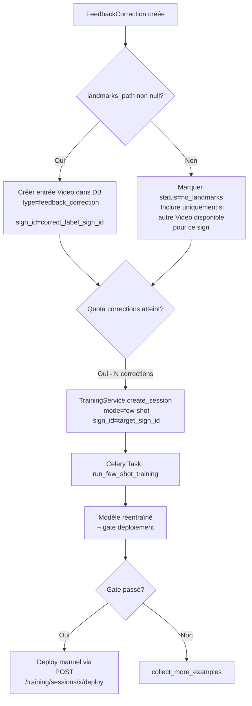
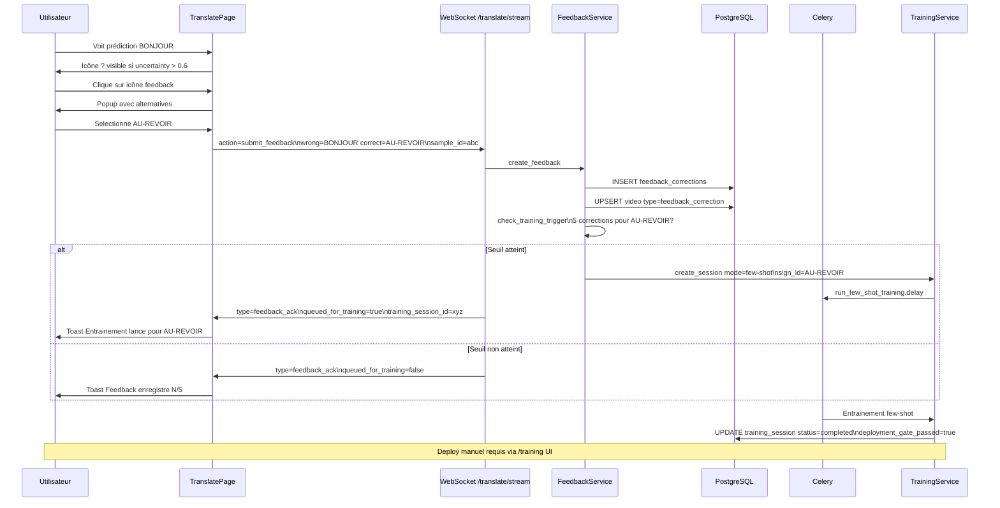

# Architecture : Correction / Feedback Utilisateur en Temps Réel

**Date :** 2026-03-03  
**Auteur :** Architect (Kilo Code)  
**Statut :** Proposition — en attente de validation

---

## Table des matières

1. [Résumé de l'existant](#1-résumé-de-lexistant)
2. [Architecture proposée](#2-architecture-proposée)
   - 2.1 [Flux utilisateur](#21-flux-utilisateur)
   - 2.2 [API backend](#22-api-backend)
   - 2.3 [Stockage des corrections](#23-stockage-des-corrections)
   - 2.4 [Pipeline ML](#24-pipeline-ml)
   - 2.5 [Frontend](#25-frontend)
3. [Décisions techniques](#3-décisions-techniques)
4. [Plan d'implémentation](#4-plan-dimplémentation)

---

## 1. Résumé de l'existant

### 1.1 Système d'apprentissage actif (Active Learning)

Le fichier [`backend/app/ml/active_learning.py`](../../backend/app/ml/active_learning.py:128) implémente une `ActiveLearningQueue` en mémoire qui :

- **Détecte automatiquement** les prédictions incertaines en calculant un score d'incertitude via trois stratégies : `entropy`, `margin`, `combined`.
- **Stocke** les `ActiveLearningSample` en mémoire (max 2000 entrées, top 250 exposés via API).
- **Expose deux endpoints REST** dans [`backend/app/api/translate.py`](../../backend/app/api/translate.py:557) :
  - `GET /translate/active-learning/queue` — liste les samples les plus incertains.
  - `POST /translate/active-learning/queue/{sample_id}/resolve` — supprime un sample après annotation.

Ce système capture **automatiquement les prédictions à faible confiance** pendant la traduction en temps réel (WebSocket `/translate/stream`).

### 1.2 Flux WebSocket existant

Le WebSocket [`/translate/stream`](../../backend/app/api/translate.py:597) gère déjà :
- Des **messages d'action** bidirectionnels (`action: "reset_conversation"`, `action: "set_grammar_mode"`).
- L'émission d'un **hint active-learning** dans chaque payload de prédiction (`active_learning.queued`, `sample_id`, `uncertainty`).
- Le `sentence_buffer` accumulé avec les signes détectés.

### 1.3 Service d'entraînement few-shot

Le [`TrainingService`](../../backend/app/services/training_service.py:65) supporte le mode `few-shot` avec :
- Chargement de landmarks existants (via [`Video`](../../backend/app/models/video.py:18) avec `landmarks_extracted=True`).
- Augmentation intensive (jusqu'à 32 augmentations par sample pour < 5 clips).
- Stratify split, gate de déploiement configurable.
- Exécution asynchrone via Celery ([`backend/app/tasks/training_tasks.py`](../../backend/app/tasks/training_tasks.py)).

### 1.4 Flux "Signe inconnu" existant dans TranslatePage

La [`TranslatePage`](../../frontend/src/pages/TranslatePage.tsx:109) contient déjà :
- Un prompt `UnknownPromptMode` ("decision" | "assign") déclenché sur basse confiance.
- La fonction [`handoffToTraining()`](../../frontend/src/pages/TranslatePage.tsx:408) qui capture un **pre-roll clip** et redirige vers `/training` avec un `pendingClip` dans le `trainingStore`.
- Un mode "assigner à un signe existant" avec recherche de signes en live.

### 1.5 Lacunes actuelles

| Besoin | État actuel |
|--------|-------------|
| Corriger une prédiction **correcte mais mal étiquetée** | ❌ Non supporté |
| Dire "ce signe est X, pas Y" **pendant la traduction** | ❌ Non supporté |
| Stocker les corrections comme données d'entraînement | ❌ Non supporté (la queue AL est en mémoire, volatile) |
| Déclencher un fine-tuning depuis une correction | Partiel (handoff manuel vers `/training`) |
| Feedback sur une prédiction **confiante mais incorrecte** | ❌ Non supporté |

---

## 2. Architecture proposée

### 2.1 Flux utilisateur

Deux scénarios de correction :

#### Scénario A — Correction immédiate (inline, pendant la traduction)

```
Utilisateur voit prédiction "BONJOUR" (confiance: 0.85)
         │
         ▼
Bouton "❌ Corriger" visible au survol/tap sur la prédiction
         │
         ▼
Popup non-intrusive : "Ce signe est ?" + liste de 5 alternatives + champ texte
         │
         ├─── Sélectionne "AU-REVOIR"
         │         │
         │         ▼
         │    POST /translate/feedback  {wrong: "BONJOUR", correct: "AU-REVOIR", landmarks_ref: sample_id}
         │         │
         │         ▼
         │    Toast "Feedback enregistré ✓" — traduction continue sans interruption
         │
         └─── Ignore (ferme popup)
```

#### Scénario B — Correction d'un signe dans le sentence buffer

```
Buffer affiché : "BONJOUR TU COMMENT"
         │
         ▼
Tap/clic sur un token du buffer → highlight + menu contextuel
         │
         ▼
"Remplacer par…" → recherche signe + confirmation
         │
         ▼
PATCH /translate/feedback/{id}  {corrected_label: "SALUT"}
```

#### Scénario C — Auto-déclenchement depuis le hint active-learning (existant étendu)

```
WS reçoit active_learning: {queued: true, sample_id: "abc", uncertainty: 0.72}
         │
         ▼
Indicateur "?" discret sur la prédiction (non modal, non bloquant)
         │
         ▼
Utilisateur tape l'indicateur → Scénario A
```

### 2.2 API backend

#### Nouveaux endpoints

```
POST   /api/v1/translate/feedback
PATCH  /api/v1/translate/feedback/{feedback_id}
GET    /api/v1/translate/feedback              (admin/debug)
POST   /api/v1/translate/feedback/{feedback_id}/trigger-training
```

##### `POST /translate/feedback` — Soumettre une correction

**Request body :**
```json
{
  "wrong_prediction": "BONJOUR",
  "correct_label": "AU-REVOIR",
  "confidence_at_correction": 0.85,
  "sample_id": "uuid-from-active-learning-hint",
  "landmarks_snapshot": null,
  "frame_idx": 1240,
  "timestamp": 1741026000.123,
  "sentence_buffer": "BONJOUR TU COMMENT",
  "source": "inline_correction"
}
```

**Notes :**
- `sample_id` est optionnel : si fourni, lié au sample de la `ActiveLearningQueue`, qui est ensuite résolu.
- `landmarks_snapshot` : champ optionnel pour les frames bruts (landmarks serialisés) à stocker pour réentraînement.
- `source` : `"inline_correction"` | `"buffer_edit"` | `"active_learning_resolution"`.

**Response :**
```json
{
  "feedback_id": "uuid",
  "status": "recorded",
  "queued_for_training": false,
  "pending_count": 3
}
```

##### `POST /translate/feedback/{feedback_id}/trigger-training`

Déclenche un few-shot sur le signe ciblé si le quota de corrections est atteint.

**Response :**
```json
{
  "training_session_id": "uuid",
  "sign_id": "uuid",
  "mode": "few-shot",
  "triggered_by": "feedback_threshold",
  "feedback_count": 5
}
```

#### Intégration WebSocket (action messages)

Étendre le protocole WS existant avec un nouveau message client :

```json
{
  "action": "submit_feedback",
  "wrong_prediction": "BONJOUR",
  "correct_label": "AU-REVOIR",
  "sample_id": "uuid",
  "frame_idx": 1240
}
```

Le backend répond avec :
```json
{
  "type": "feedback_ack",
  "feedback_id": "uuid",
  "ok": true,
  "queued_for_training": false
}
```

**Avantage :** Pas besoin d'une requête HTTP séparée ; le WebSocket ouvert est réutilisé, ce qui réduit la latence et la complexité côté client.

### 2.3 Stockage des corrections

#### Option retenue : Nouveau modèle `FeedbackCorrection` (table dédiée)

Plutôt qu'étendre `Video` ou `Sign`, une table dédiée offre :
- Traçabilité complète des corrections (audit trail).
- Séparation nette entre données d'entraînement validées (table `videos`) et corrections brutes.
- Possibilité de filtrer/valider avant d'intégrer au pipeline.

**Modèle SQLAlchemy (`backend/app/models/feedback.py`) :**

```python
class FeedbackCorrection(Base):
    __tablename__ = "feedback_corrections"

    id: str                          # UUID PK
    wrong_prediction: str            # Signe prédit (incorrect)
    correct_label: str               # Label corrigé par l'utilisateur
    confidence_at_correction: float  # Confiance au moment de la correction
    source: str                      # "inline_correction" | "buffer_edit" | "active_learning"
    
    # Référence optionnelle au sample active learning
    active_learning_sample_id: str | None
    
    # Données de landmarks (optionnel — si client envoie les frames)
    landmarks_path: str | None       # Chemin vers NPZ stocké sur disque
    frame_idx: int | None
    timestamp: float | None
    sentence_buffer: str | None
    
    # Relation vers Sign (signe corrigé)
    sign_id: str | None              # FK → signs.id (nullable si signe nouveau)
    
    # Relation vers Video si clip enregistré via pre-roll
    video_id: str | None             # FK → videos.id (nullable)
    
    # Statut de traitement
    status: str  # "pending" | "used_in_training" | "rejected" | "duplicate"
    training_session_id: str | None  # Si utilisé dans un entraînement
    
    created_at: datetime
    user_id: int | None              # FK → users.id (nullable — auth optionnelle)
```

**Migration Alembic :** nouvelle migration `20260303_0007_add_feedback_corrections.py`.

#### Règle de promotion automatique

Quand N corrections sur le même `correct_label` atteignent un seuil configurable (`FEEDBACK_TRAINING_TRIGGER_COUNT`, défaut = 5) :
1. Chercher le `sign_id` correspondant au `correct_label` dans la table `signs`.
2. S'il existe : déclencher une session `few-shot` sur ce signe via `TrainingService.create_session()`.
3. S'il n'existe pas : marquer les corrections `status=pending` et notifier l'admin.

### 2.4 Pipeline ML

#### Intégration des corrections dans le réentraînement

La stratégie retenue est d'utiliser le mode **few-shot existant** du `TrainingService` sans modification de ce service. Les landmarks des corrections alimenteront la base de données `Video` existante.

**Flux de promotion :**



#### Stockage des landmarks de feedback

Les frames envoyées via WS sont des landmarks MediaPipe serialisés. Pour les stocker :

1. **Backend reçoit** `landmarks_snapshot` : array NumPy serialisé (JSON array ou base64).
2. **Sauvegarde** en `.npz` dans `backend/data/videos/feedback/{feedback_id}.npz` (même format que les landmarks existants).
3. **Crée** une entrée `Video` avec `type="feedback_correction"`, `landmarks_extracted=True`, `landmarks_path` pointant vers le `.npz`.
4. **Marque** `is_trainable=True` si `detection_rate >= 0.8` (gate existant dans `TrainingService._passes_detection_gate()`).

#### Sans landmarks (correction textuelle pure)

Si l'utilisateur corrige sans envoyer de frames (correction rétrospective depuis buffer) :
- La `FeedbackCorrection` est stockée avec `landmarks_path=None`.
- Elle sert à **ajuster les thresholds de confiance** par classe via `TrainingService._learn_class_thresholds()` lors du prochain réentraînement complet.
- Elle est comptabilisée pour vérifier si un signe est systémiquement mal reconnu, mais n'alimente pas directement le dataset few-shot.

### 2.5 Frontend

#### Composant `FeedbackButton`

Composant non-intrusif positionné sur la carte de prédiction :

```tsx
// frontend/src/components/translate/FeedbackButton.tsx
interface FeedbackButtonProps {
  prediction: string;
  confidence: number;
  sampleId?: string;        // From active_learning hint
  frameIdx?: number;
  alternatives: Array<{sign: string; confidence: number}>;
  onSubmit: (correction: FeedbackPayload) => void;
}
```

**Comportement :**
- Icône `✏️` discrète visible au hover/tap sur la carte de prédiction.
- Si `sampleId` présent (hint AL) → icône `?` toujours visible avec badge orange.
- Clic → popup légère (pas de modale plein écran) avec :
  - Prédiction actuelle en gras.
  - 4-5 alternatives (pré-remplies depuis `alternatives` du payload WS).
  - Champ de recherche pour autres signes.
  - Bouton "Confirmer la correction".

#### Composant `SentenceTokenEditor`

Extension du buffer de phrase affiché :

```tsx
// frontend/src/components/translate/SentenceTokenEditor.tsx
interface SentenceTokenEditorProps {
  buffer: string;          // "BONJOUR TU COMMENT"
  onCorrect: (tokenIndex: number, newLabel: string) => void;
}
```

**Comportement :** Tokens cliquables → mini-menu contextuel ("Remplacer", "Supprimer").

#### Intégration dans `TranslatePage`

```tsx
// Dans le bloc "Signe détecté" existant de TranslatePage.tsx
<FeedbackButton
  prediction={displayedPrediction}
  confidence={displayedConfidence}
  sampleId={activeLearningHint?.sample_id}
  alternatives={live.alternatives}
  onSubmit={handleFeedback}
/>

// Dans le bloc "Signes en cours"
<SentenceTokenEditor
  buffer={live.sentenceBuffer}
  onCorrect={handleBufferCorrection}
/>
```

#### Store Zustand `feedbackStore`

```typescript
// frontend/src/stores/feedbackStore.ts
interface FeedbackStore {
  pendingFeedbacks: FeedbackPayload[];
  submitFeedback: (payload: FeedbackPayload) => Promise<void>;
  // Envoie via WS si connecté, sinon via REST fallback
  lastFeedbackStatus: "idle" | "pending" | "success" | "error";
}
```

---

## 3. Décisions techniques

### D1 — WebSocket vs REST pour soumettre un feedback

**Choix : WebSocket en premier, REST en fallback.**

- Le WS est déjà ouvert pendant la traduction. Envoyer le feedback via WS évite une requête HTTP supplémentaire et maintient la cohérence de la session (même `frame_idx`, `timestamp`).
- L'action message `submit_feedback` s'intègre dans le pattern existant (`reset_conversation`, `set_grammar_mode`).
- REST endpoint `POST /translate/feedback` reste disponible pour les cas hors-traduction (ex: correction depuis l'historique).

### D2 — Nouveau modèle `FeedbackCorrection` vs extension `Video`

**Choix : Table dédiée `FeedbackCorrection`.**

- La table `Video` modélise des clips vidéo avec landmarks extraits. Une correction textuelle n'a pas de vidéo.
- Séparer les corrections permet d'appliquer une politique de validation différente (ex: dédupliquer, valider manuellement avant d'entraîner).
- Les corrections validées créent ensuite des entrées `Video` de type `feedback_correction`, réutilisant le pipeline existant sans modification.

### D3 — Déclenchement automatique vs manuel du réentraînement

**Choix : Semi-automatique avec seuil configurable.**

- Déclenchement **automatique** risque de polluer le modèle avec des corrections erronées ou contradictoires.
- Déclenchement **entièrement manuel** réduit la valeur de la feature.
- **Compromis** : déclenchement automatique après N corrections (`FEEDBACK_TRAINING_TRIGGER_COUNT=5`) sur un même signe, mais avec une gate de déploiement : le modèle produit ne s'active **pas** automatiquement — l'utilisateur doit confirmer via `POST /training/sessions/{id}/deploy` (même flow que l'entraînement normal).

### D4 — Stockage des landmarks de feedback

**Choix : `.npz` dans `backend/data/videos/feedback/` + entrée `Video`.**

- Réutilise le format de landmarks existant (`load_landmarks_from_file` dans `dataset.py`).
- Évite de doubler la logique d'extraction.
- La détection-rate est calculée côté frontend (nb de frames avec mains détectées / total) et envoyée dans le payload pour le gate.

### D5 — Landmarks optionnels

**Choix : Landmarks optionnels.**

- Une correction "textuelle pure" (rétroactive via buffer) sans landmarks a quand même de la valeur pour l'analyse des erreurs et les ajustements de seuils.
- Pas de blocage UX si l'utilisateur ne veut pas envoyer de frames.
- Les corrections sans landmarks sont comptabilisées mais ne déclenchent pas de few-shot directement.

### D6 — No-auth sur l'endpoint feedback

**Choix : Cohérence avec l'existant (pas d'auth obligatoire), user_id nullable.**

- La plupart des endpoints business ne sont pas protégés. Garder la cohérence.
- `user_id` est storé si l'utilisateur est authentifié (JWT présent), sinon `null`.
- Revue en production : rate-limiting (`enforce_write_rate_limit` existant) suffit pour éviter le spam.

---

## 4. Plan d'implémentation

### Étape 1 — Migration DB et modèle `FeedbackCorrection`

- [ ] Créer `backend/app/models/feedback.py` avec le modèle `FeedbackCorrection`
- [ ] Créer la migration Alembic `backend/alembic/versions/20260303_0007_add_feedback_corrections.py`
- [ ] Ajouter `FeedbackCorrection` aux imports dans `backend/app/models/__init__.py`

### Étape 2 — Schémas Pydantic

- [ ] Créer `backend/app/schemas/feedback.py` avec :
  - `FeedbackCorrectionCreate` (payload request)
  - `FeedbackCorrectionResponse` (response)
  - `FeedbackTriggerTrainingResponse`

### Étape 3 — Service `FeedbackService`

- [ ] Créer `backend/app/services/feedback_service.py` avec :
  - `create_feedback()` — persiste en DB, gère le stockage NPZ optionnel
  - `check_training_trigger()` — vérifie le seuil et déclenche le few-shot
  - `get_pending_feedbacks()` — pour l'admin/debug
  - `_save_landmarks_npz()` — sauvegarde le snapshot de landmarks

### Étape 4 — Endpoints REST

- [ ] Créer `backend/app/api/feedback.py` avec les 4 endpoints :
  - `POST /translate/feedback`
  - `PATCH /translate/feedback/{feedback_id}`
  - `GET /translate/feedback`
  - `POST /translate/feedback/{feedback_id}/trigger-training`
- [ ] Monter le router dans `backend/app/api/router.py` sous `/translate`

### Étape 5 — Intégration WS (`submit_feedback` action)

- [ ] Dans `backend/app/api/translate.py`, ajouter le handler pour `action == "submit_feedback"` dans la boucle WS
- [ ] Répondre avec `{"type": "feedback_ack", ...}`
- [ ] Lier au `FeedbackService`

### Étape 6 — Variable d'environnement et config

- [ ] Ajouter dans `backend/app/config.py` :
  - `FEEDBACK_TRAINING_TRIGGER_COUNT: int = 5`
  - `FEEDBACK_LANDMARKS_DIR: str = "data/videos/feedback"`
  - `FEEDBACK_ENABLED: bool = True`
- [ ] Mettre à jour `.env.example` et la doc `AGENTS.md`

### Étape 7 — Composant `FeedbackButton` (Frontend)

- [ ] Créer `frontend/src/components/translate/FeedbackButton.tsx`
- [ ] Créer `frontend/src/components/translate/FeedbackPopup.tsx` (popup légère)
- [ ] Ajouter les styles dans le système Tailwind existant

### Étape 8 — Composant `SentenceTokenEditor` (Frontend)

- [ ] Créer `frontend/src/components/translate/SentenceTokenEditor.tsx`
- [ ] Tokeniser `sentence_buffer` sur les espaces
- [ ] Menu contextuel sur click/tap token

### Étape 9 — Store `feedbackStore` (Frontend)

- [ ] Créer `frontend/src/stores/feedbackStore.ts`
- [ ] Implémenter la logique WS-first / REST-fallback
- [ ] Exposer `submitFeedback()`, `lastFeedbackStatus`

### Étape 10 — Intégration dans `TranslatePage`

- [ ] Importer et connecter `FeedbackButton` sur la carte de prédiction
- [ ] Remplacer `<p>` buffer brut par `<SentenceTokenEditor>`
- [ ] Connecter `activeLearningHint.sample_id` au `FeedbackButton`
- [ ] Ajouter le handler WS `feedback_ack` dans `onMessage`
- [ ] Étendre `StreamPayload` avec le type `feedback_ack`

### Étape 11 — Tests backend

- [ ] `backend/tests/test_api/test_feedback.py` : tests CRUD feedback
- [ ] `backend/tests/test_services/test_feedback_service.py` : tests déclenchement entraînement
- [ ] Test d'intégration WS pour l'action `submit_feedback`

### Étape 12 — Tests frontend

- [ ] `frontend/src/components/translate/__tests__/FeedbackButton.test.tsx`
- [ ] Tests du `feedbackStore` : submit via WS, fallback REST

---

## Annexe — Diagramme de flux complet



---

## Annexe — Invariants de compatibilité

- Aucun endpoint existant n'est modifié.
- Le protocole WS ajoute une action optionnelle ; les clients qui ne l'utilisent pas ne sont pas impactés.
- Le mode `few-shot` du `TrainingService` est appelé sans modification, uniquement avec un `sign_id` existant.
- La migration Alembic est additive (nouvelle table uniquement).
- Les variables d'environnement ajoutées ont toutes des valeurs par défaut.
