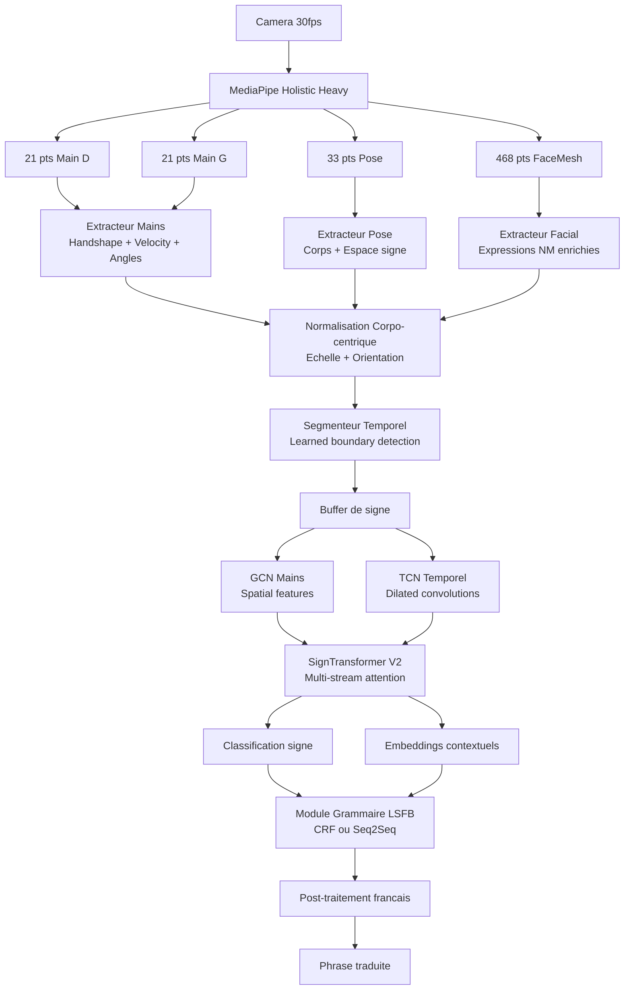
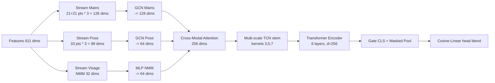
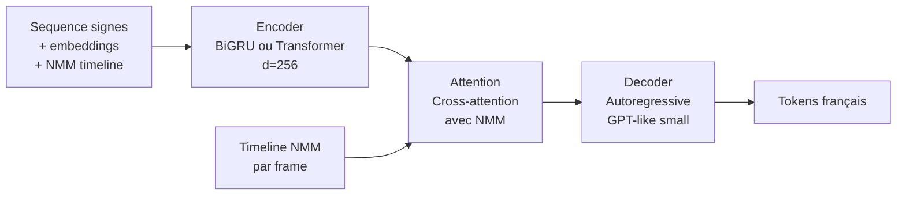
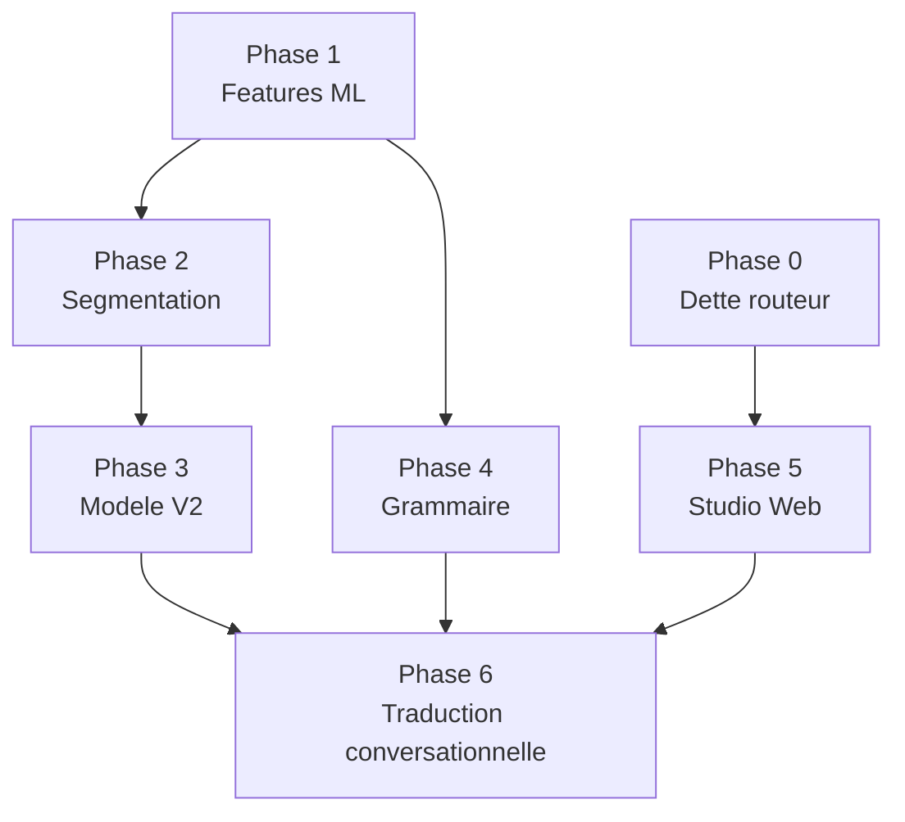

# SignFlow V2 — Plan d'Architecture pour Améliorations Majeures

**Date :** 2026-03-03  
**Auteur :** Analyse architecturale automatisée  
**Statut :** Proposition — à valider avant implémentation

---

## Table des Matières

1. [État Actuel — Forces et Faiblesses](#1-état-actuel--forces-et-faiblesses)
2. [Architecture ML Améliorée](#2-architecture-ml-améliorée)
3. [Modules à Créer ou Modifier](#3-modules-à-créer-ou-modifier)
4. [Plan de Grammaire LSFB Automatique](#4-plan-de-grammaire-lsfb-automatique)
5. [Spécifications du Studio Web](#5-spécifications-du-studio-web)
6. [Plan d'Implémentation par Phases](#6-plan-dimplémentation-par-phases)
7. [Considérations Techniques](#7-considérations-techniques)

---

## 1. État Actuel — Forces et Faiblesses

### 1.1 Pipeline ML — Ce qui existe

#### Extraction de features (`features.py`, `feature_engineering.py`)

**Forces :**
- Features enrichies : coordonnées XYZ (225 dims) + vélocités (225 dims) + distances inter-mains (5 dims) + angles articulaires (4 dims) + formes de main (10 dims) + expressions faciales (12 dims) + vélocités faciales (12 dims) = **`ENRICHED_FEATURE_DIM` = 493 dims**
- Normalisation du corps par centre des hanches et largeur des épaules (`normalize_body_frame`) pour l'invariance inter-utilisateurs
- Encodeur spatial GCN optionnel (`spatial_encoder.py`) pour apprendre les relations squelettiques
- Expressions faciales : ouverture bouche, largeur, rondeur, sourire, yeux, sourcils (12 descripteurs)

**Faiblesses identifiées :**
- `include_face=False` dans `process_frame` → **les landmarks faciaux bruts ne sont pas utilisés en inférence**, seulement les 12 descripteurs compacts. La richesse des 468 points FaceMesh est perdue
- L'encodeur GCN (`spatial_encoder.py`) est présent mais **pas branché** dans la pipeline d'inférence principale
- Seulement 4 angles articulaires (coudes + poignets) — la pose complète du corps est sous-exploitée
- Le score de forme de main (10 features) ne capture pas la configuration des doigts (handshape) qui est essentielle en LSFB
- Pas de features de **localisation spatiale des mains par rapport au corps** (espace signé)

#### Modèle (`model.py`)

**Forces :**
- `SignTransformer` : architecture Transformer encoder avec CLS token, encodage positionnel sinusoïdal, biais d'attention relatifs
- Multi-scale temporal stem (conv1D à kernels 3, 5, 7) pour capturer différentes échelles temporelles
- Fusion CLS + masked temporal pooling via gate appris
- Tête cosinus hybride (cosine + linear blend) pour la métrologie
- Token dropout, temporal smoothing, label smoothing, focal loss — robustesse à l'imbalance

**Faiblesses :**
- Architecture mono-flux : les features mains, corps, visage sont toutes concaténées dans un seul vecteur **sans séparation des modalités**. Un Transformer multi-stream (mains / pose / visage séparément) serait plus expressif
- Pas de mémoire contextuelle entre signes — chaque signe est classifié indépendamment
- Pas de module de segmentation temporelle appris — utilise un simple seuil de motion energy
- L'encodage positionnel sinusoïdal suppose une vitesse d'exécution uniforme — problème si le signeur ralentit ou accélère

#### Pipeline d'inférence (`pipeline.py`)

**Forces :**
- Machine à états (IDLE → RECORDING → INFERRING) avec détection de mouvement et repos
- Pre-roll frames, smoothing temporel, TTA (miroir + jitter temporel + bruit spatial)
- Seuils adaptatifs par classe, calibration de température, monitoring drift
- Spawn de sessions isolées par connexion WebSocket

**Faiblesses :**
- Segmentation basée uniquement sur `motion_energy` des mains → **manque de robustesse** pour les signes à faible amplitude ou les transitions rapides
- Le `sentence_buffer` est une simple concaténation de tokens — **pas de modèle grammatical** entre les signes
- `is_sentence_complete` est toujours `False` — la détection de fin de phrase n'est pas implémentée
- Pas d'utilisation de la trajectoire des mains dans l'espace signé (loci grammaticaux)

#### Frontend (`useMediaPipe.ts`, `TranslatePage.tsx`)

**Forces :**
- MediaPipe Holistic complexité 2 (heavy), 30 FPS, refineFaceLandmarks activé
- Métadonnées de confiance (leftHandVisible, rightHandVisible, averageConfidence)
- Hook optimisé `useMediaPipeOptimized.ts` avec FPS adaptatif et fallback multi-stage

**Faiblesses :**
- Envoi WS limité à 12 FPS (`WS_SEND_TARGET_FPS = 12`) alors que MediaPipe tourne à 30 FPS → **perte de 60% des frames**
- `includeFace: true` est passé à MediaPipe mais les données face sont une liste de points bruts — le hook ne calcule pas les descripteurs faciaux avancés
- Pas de visualisation de l'espace signé ni des loci grammaticaux

### 1.2 Frontend — Pages avancées non montées

Comme documenté dans `AGENTS.md`, `DashboardPage`, `DictionaryPage`, `TrainPage`, `SettingsPage` existent mais ne sont pas montées dans le routeur. C'est une dette technique prioritaire.

---

## 2. Architecture ML Améliorée

### 2.1 Vue d'ensemble du pipeline V2



### 2.2 Extracteur de Features V2

**Dimensions cibles pour le pipeline V2 :**

| Groupe | Dims actuelles | Dims V2 | Amélioration |
|--------|---------------|---------|--------------|
| Coordonnées XYZ corps | 225 | 225 | Inchangé |
| Vélocités | 225 | 225 | Inchangé |
| Distances inter-mains | 5 | 5 | Inchangé |
| Angles articulaires | 4 | 20 | +16 : doigts + poignets 3D |
| Forme de main (handshape) | 10 | 42 | +32 : distances doigts normalisées complètes |
| Expressions faciales | 12 | 32 | +20 : Action Units FACS-like |
| Vélocités faciales | 12 | 32 | Aligné sur nouvelles features faciales |
| Espace signé (loci) | 0 | 18 | NOUVEAU : 6 loci x 3 coords relatives |
| Orientation des mains | 0 | 12 | NOUVEAU : quaternions approchés |
| **Total** | **493** | **611** | |

#### 2.2.1 Handshape enrichi (42 dims par rapport aux 10 actuels)

Le handshape est la configuration des doigts — essentiel en langue des signes. Actuellement seulement 5 distances par main (10 total). La V2 doit capturer :
- Distance wrist→tip pour les 5 doigts (5 per hand = 10)
- Distance entre tous les fingertips adjacents (4 per hand = 8)
- Angle de chaque doigt par rapport au poignet (5 per hand = 10)
- Degré d'extension/flexion de chaque articulation (5 per hand = 10)
- Orientation globale de la paume (normale au plan de la main = 3D) = 4 dims par main

Nouveau module : `backend/app/ml/handshape_features.py`

#### 2.2.2 Expressions Non-Manuelles enrichies (32 dims)

Les marqueurs non-manuels (NMM) sont grammaticalement cruciaux en LSFB. Les 12 dims actuels couvrent seulement ouverture/largeur bouche, yeux et sourcils. La V2 doit ajouter :

- **Yeux :** ratio ouverture vertical/horizontal (2D), clignotement, regard latéral (4 dims)
- **Sourcils :** position relative Y gauche/droit, angle, froncement (4 dims)
- **Bouche :** 6 Action Units supplémentaires (tension, étirement, protrusion labiale) (6 dims)
- **Joues :** gonflement (2 dims)
- **Tête :** inclinaison (roll, pitch, yaw) derivé des landmarks faciaux au lieu d'une IMU (6 dims)
- **Intensité globale :** score composite (4 dims)

Ces NMM permettent de détecter :
- Négation (front plissé + moue)
- Question oui/non (sourcils levés)
- Question-WH (sourcils froncés)
- Assertions (hochement tête)
- Intensité émotionnelle

Nouveau module : `backend/app/ml/facial_action_units.py`

#### 2.2.3 Espace Signé (18 dims — NOUVEAU)

L'espace de signation (signing space) en LSFB utilise des **loci** — positions dans l'espace devant le signeur associées à des référents. Detection des loci :
- Zones autour du corps (gauche/centre/droite × haut/milieu/bas = 6 zones × 3 coords = 18 dims)
- Position des mains dans ces zones normalise sur le torse

### 2.3 Architecture SignTransformer V2 (Multi-Stream)

Au lieu de concatener toutes les features, la V2 traite les modalités séparément :



Fichiers à modifier : `backend/app/ml/model.py` — Nouvelle classe `SignTransformerV2`

### 2.4 Segmentation Temporelle Appris

Le problème actuel : détection de début/fin de signe par seuil de motion energy. Cela échoue pour :
- Les signes à faible amplitude (signes proche du visage)
- Les transitions rapides entre signes (coarticulation)
- Les pauses dans un signe complexe

**Proposition :** module de segmentation dédié basé sur un binary classifier léger (BiLSTM ou TCN 2-classes) entraîné sur des annotations de frontières de signes.

Architecture proposée :

```
FrameFeatures(t) → [BiLSTM 2 couches, hidden=64] → P(boundary_at_t) ∈ [0,1]
```

Ce classifier prédit pour chaque frame la probabilité qu'elle soit une frontière entre deux signes. Le pipeline remplace le seuil de motion energy par ce score.

Nouveau module : `backend/app/ml/sign_segmentation.py`

---

## 3. Modules à Créer ou Modifier

### 3.1 Backend — Nouveaux modules

#### `backend/app/ml/handshape_features.py` (NOUVEAU)
```
Rôle : Calcul des 42 features de handshape par main
Entrée : landmarks 21 pts per hand (63 coords)
Sortie : vecteur 21 dims per hand (42 total)
Méthode : distances normalisées, angles doigts, orientation paume
Dépendances : numpy, feature_engineering.py
```

#### `backend/app/ml/facial_action_units.py` (NOUVEAU)
```
Rôle : Action Units FACS-like depuis FaceMesh 468 pts
Entrée : face_points 468 * 3 coords + body_scale
Sortie : vecteur 32 dims (NMM enrichis)
Méthode : ratios géométriques sur indices MediaPipe clés
Dépendances : numpy, features.py (indices FaceMesh)
```

#### `backend/app/ml/signing_space.py` (NOUVEAU)
```
Rôle : Détection des loci et de la zone de signation
Entrée : pose + mains normalisées
Sortie : 18 dims (position relative dans l'espace signé)
Méthode : normalisation par torse, quantification des zones
Dépendances : numpy, feature_engineering.py
```

#### `backend/app/ml/sign_segmentation.py` (NOUVEAU)
```
Rôle : Segmentation temporelle apprise des signes
Architecture : BiLSTM(2 layers, h=64) + Sigmoid → P(boundary)
Entrée : séquence de feature vectors courants (fenêtre glissante)
Sortie : score de frontière [0,1] par frame
Entraînement : annotations manuelles de frontières sur dataset
Intégration : remplace la logique motion_energy dans pipeline.py
```

#### `backend/app/ml/grammar.py` (NOUVEAU)
```
Rôle : Module de grammaire LSFB
Architecture : Voir section 4
Entrée : séquence de tokens signes + embeddings contextuels
Sortie : tokens ordonnés + traduction française partielle
Dépendances : backend/app/ml/lsfb_grammar_rules.py
```

#### `backend/app/ml/lsfb_grammar_rules.py` (NOUVEAU)
```
Rôle : Règles heuristiques de grammaire LSFB pour bootstrap
Contenu : patterns Topique-Commentaire, ordre OSV, négation NMM
Utilisé par : grammar.py comme prior ou post-filtre
```

### 3.2 Backend — Modules à modifier

#### `backend/app/ml/features.py` (MAJEUR)
```
Modifications :
- Ajouter appel à handshape_features.py dans normalize_landmarks()
- Ajouter appel à facial_action_units.py → remplacer _compute_facial_expression_features
- Ajouter appel à signing_space.py
- Mettre à jour ENRICHED_FEATURE_DIM de 493 → 611
- Mettre à jour include_face=True paths
```

#### `backend/app/ml/feature_engineering.py` (MOYEN)
```
Modifications :
- Augmenter HAND_SHAPE_FEATURE_DIM de 10 → 42
- Augmenter FACIAL_EXPRESSION_FEATURE_DIM de 12 → 32
- Ajouter SIGNING_SPACE_FEATURE_DIM = 18 (nouveau)
- Ajouter HAND_ORIENTATION_FEATURE_DIM = 12 (nouveau)
- Recalculer ENRICHED_FEATURE_DIM
```

#### `backend/app/ml/model.py` (MAJEUR)
```
Modifications :
- Ajouter classe SignTransformerV2 avec architecture multi-stream
- Garder SignTransformer V1 pour compatibilité ascendante
- Ajouter GCN streams optionnels (si torch-geometric disponible)
- Ajouter cross-modal attention layer
```

#### `backend/app/ml/pipeline.py` (MOYEN)
```
Modifications :
- Intégrer SignSegmentation si modèle disponible
- Passer include_face=True à normalize_landmarks dans process_frame
- Ajouter support SignTransformerV2 dans load_model
- Ajouter sentence_buffer grammatical (appel grammar.py)
- Implémenter is_sentence_complete via détection pause/hésitation
```

#### `backend/app/ml/trainer.py` (MINEUR)
```
Modifications :
- Ajouter support multi-stream data loading
- Ajouter tâche auxiliaire de segmentation (multi-task training)
- Ajouter DataLoader pour annotations grammaticales
```

#### `backend/app/api/translate.py` (MINEUR)
```
Modifications :
- Ajouter champ grammar_output dans réponse WS
- Ajouter champ nmm_features dans réponse pour visualisation
- Exposer endpoint REST POST /translate/correct pour feedback humain
```

### 3.3 Frontend — Pages avancées à monter (dette actuelle)

#### `frontend/src/routes.tsx` (URGENT — dette technique)
```
Modifications :
- Remplacer les placeholders par DashboardPage, DictionaryPage, TrainPage, SettingsPage
- Corriger /train → /training dans les navigations
- Voir AGENTS.md section 12 Known Gaps
```

### 3.4 Frontend — Nouveau Studio Web

Voir section 5.

---

## 4. Plan de Grammaire LSFB Automatique

### 4.1 Particularités grammaticales de la LSFB

La LSFB (Langue des Signes de Belgique Francophone) a une grammaire visuo-spatiale distincte :

| Trait | Description | Impact technique |
|-------|-------------|-----------------|
| Ordre des mots | Topique-Commentaire, OSV possible | Nécessite réordonnancement |
| NMM négation | Front plissé + moue + secouer tête | Feature faciale critique |
| NMM question Y/N | Sourcils levés en fin de phrase | Détection de type de phrase |
| NMM question WH | Sourcils froncés, traits tendus | Catégorie de phrase |
| Classifieurs | Handshapes représentant objets/personnes | Classes sémantiques de signes |
| Espace de signation | Loci 3D pour référents | Features spatiales |
| Accord verbal | Verbes directionnels d et b | Trajectoire dans l'espace |
| Mouthing | Articulation bouche parallèle | Features bouche |

### 4.2 Architecture en Phases

#### Phase A : Règles heuristiques (bootstrap)

Un module `lsfb_grammar_rules.py` contenant des règles **déterministes** pour les cas courants :

```python
# Exemple de règle :
# Si dernier token = NEGATIF et NMM_front_plisse > 0.6 → inverser assertion
# Si NMM_sourcils_leves pendant sequence → marquer comme question Y/N
# Ordre OSV : [OBJET signe espacé à gauche] [SUJET] [VERBE] → réordonner
```

**Avantages :** interprétable, aucune donnée annotée nécessaire, déployable immédiatement  
**Limites :** couverture partielle, pas d'apprentissage

#### Phase B : CRF sur tokens de signes

Un **CRF (Conditional Random Field)** linéaire pour le reséquençage grammatical :

```
Input:  [signe_1, signe_2, ..., signe_n] + features NMM per frame
Output: [label grammatical: SUJET, VERBE, OBJET, NEGATION, QUESTION...] per signe

Architecture :
  Emission features : embedding signe (128d) + NMM features (32d) + position spatiale (18d)
  Transition constraints : règles LSFB encodées dans les poids de transition
  Output labels : 12 étiquettes grammaticales LSFB
```

**Avantages :** structurellement contraint, peu de données nécessaires  
**Limites :** séquence linéaire, pas de structure hiérarchique

#### Phase C : Seq2Seq LSFB→Français (long terme)

Pour la traduction complète, un modèle Encoder-Decoder :



**Données nécessaires :** corpus de paires video-LSFB / phrases-français avec alignement  
**À terme :** fine-tuning d'un LLM léger (ex: mT5-small) avec prompting des tokens signes

### 4.3 Comment Apprendre la Grammaire depuis les Données

#### Dataset requis

1. **Corpus LSFB aligné** : vidéos de phrases LSFB avec transcription gloss (notation des signes) ET traduction française. Exemples : corpus LSFB-Corpus de l'UNamur, Corpus LSFB online
2. **Annotations NMM** : marquage manuel des expressions faciales grammaticales (sourcils, regard, mouvement tête) par frame
3. **Annotations de frontières** : début et fin de chaque signe dans le flux vidéo

#### Pipeline d'apprentissage automatique (self-supervised)

```
1. Collecter vidéos LSFB + traductions françaises (sans annotations détaillées)
2. Aligner automatiquement signes → mots avec DTW ou attention word-level alignment
3. Extraire patterns NMM corrélés aux types de phrases (questions, négations)
4. Entraîner CRF sur alignements + features NMM
5. Fine-tuner Seq2Seq sur paires gloss/français
```

#### Métriques d'évaluation

- BLEU-4 pour la traduction française
- Accuracy de détection des NMM (AUC par type)
- WER (Word Error Rate) sur séquences de signes

---

## 5. Spécifications du Studio Web

### 5.1 Vue d'ensemble

Le Studio est une interface web intégrée à SignFlow permettant :
1. Import et gestion de vidéos de signes
2. Extraction automatique de landmarks par frame
3. Annotation manuelle avec timeline
4. Lancement d'entraînement avec suivi en temps réel
5. Export des modèles entraînés

### 5.2 Routes API Backend à créer

#### Gestion des sessions d'annotation

| Méthode | Route | Description |
|---------|-------|-------------|
| `POST` | `/api/v1/studio/sessions` | Créer session d'annotation |
| `GET` | `/api/v1/studio/sessions` | Lister sessions |
| `GET` | `/api/v1/studio/sessions/{id}` | Détail session |
| `DELETE` | `/api/v1/studio/sessions/{id}` | Supprimer session |

#### Import et extraction de landmarks

| Méthode | Route | Description |
|---------|-------|-------------|
| `POST` | `/api/v1/studio/videos/upload` | Upload vidéo (multipart) |
| `POST` | `/api/v1/studio/videos/{id}/extract` | Lancer extraction landmarks (Celery) |
| `GET` | `/api/v1/studio/videos/{id}/status` | Statut extraction |
| `GET` | `/api/v1/studio/videos/{id}/landmarks` | Récupérer landmarks extraits |
| `GET` | `/api/v1/studio/videos/{id}/frames` | Stream frames pour annotation |

#### Annotations

| Méthode | Route | Description |
|---------|-------|-------------|
| `POST` | `/api/v1/studio/annotations` | Créer annotation (signe + frame range) |
| `GET` | `/api/v1/studio/annotations/{video_id}` | Get annotations d'une vidéo |
| `PUT` | `/api/v1/studio/annotations/{id}` | Modifier annotation |
| `DELETE` | `/api/v1/studio/annotations/{id}` | Supprimer annotation |
| `POST` | `/api/v1/studio/annotations/bulk` | Import bulk depuis CSV/JSON |
| `GET` | `/api/v1/studio/annotations/export/{format}` | Export JSON/CSV/ELAN |

#### Datasets

| Méthode | Route | Description |
|---------|-------|-------------|
| `POST` | `/api/v1/studio/datasets` | Créer dataset depuis annotations |
| `GET` | `/api/v1/studio/datasets` | Lister datasets + stats |
| `GET` | `/api/v1/studio/datasets/{id}` | Statistiques détaillées |
| `POST` | `/api/v1/studio/datasets/{id}/split` | Générer train/val/test splits |

#### Grammaire et corpus

| Méthode | Route | Description |
|---------|-------|-------------|
| `POST` | `/api/v1/studio/corpus/import` | Import corpus LSFB annoté |
| `GET` | `/api/v1/studio/corpus/search` | Recherche dans corpus |
| `POST` | `/api/v1/studio/grammar/train` | Entraîner module grammar |

### 5.3 Modèles de Données Backend à créer

#### `AnnotationSession` (nouveau modèle SQLAlchemy)
```python
class AnnotationSession(Base):
    id: str (UUID)
    name: str
    description: str | None
    created_at: datetime
    updated_at: datetime
    status: str  # "active" | "completed" | "archived"
    video_count: int
    annotation_count: int
    owner_id: str | None  # FK User
```

#### `VideoAnnotation` (nouveau modèle SQLAlchemy)
```python
class VideoAnnotation(Base):
    id: str (UUID)
    video_id: str  # FK Video
    session_id: str  # FK AnnotationSession
    sign_id: str | None  # FK Sign
    gloss: str  # Notation du signe
    start_frame: int
    end_frame: int
    start_ms: float
    end_ms: float
    confidence: float  # Confiance de l'annotateur
    nmm_flags: dict  # NMM présents : {"negation": bool, "question_yn": bool, ...}
    spatial_zone: str | None  # Zone dans l'espace signé
    notes: str | None
    created_by: str  # "manual" | "auto_suggested"
```

#### `GrammarAnnotation` (nouveau modèle SQLAlchemy)
```python
class GrammarAnnotation(Base):
    id: str (UUID)
    session_id: str
    sign_sequence: list[str]  # Sequence de gloss
    french_translation: str
    grammar_structure: dict  # Structure parsée
    source: str  # "manual" | "corpus_import"
```

### 5.4 Composants UI Frontend à créer

#### Page Studio (nouvelle route `/studio`)

```
frontend/src/pages/StudioPage.tsx          # Page principale Studio
frontend/src/pages/studio/                 # Sous-pages
  AnnotationEditorPage.tsx               # Éditeur d'annotation vidéo
  DatasetManagerPage.tsx                 # Gestion des datasets
  CorpusExplorerPage.tsx                 # Exploration du corpus
```

#### Composants d'annotation

```
frontend/src/components/studio/
  VideoTimeline.tsx           # Timeline vidéo avec pistes d'annotation
  AnnotationTrack.tsx         # Piste d'annotation avec segments colorés
  FrameViewer.tsx             # Visualiseur de frame avec landmarks
  LandmarkViewer.tsx          # Vue 3D des landmarks (Three.js ou d3)
  NMMIndicator.tsx            # Indicateurs NMM temps réel
  SignSelector.tsx            # Sélecteur de signe du dictionnaire
  BulkAnnotationTool.tsx      # Outil d'annotation bulk via patterns
  ExportDialog.tsx            # Export en différents formats
```

#### Interface de la timeline (inspirée d'ELAN)

```
┌──────────────────────────────────────────────────────────┐
│  [▶ PLAY]  [■ STOP]  [◄ -1fr] [+1fr ►]  [00:02:34.12]  │
├──────────────────────────────────────────────────────────┤
│ Vidéo :   [████████████████░░░░░░░░░░░░░░░░░░░░░░░░░░] │
├──────────────────────────────────────────────────────────┤
│ Signes :  [BONJOUR ][  COMMENT ][   VA   ][  VOUS  ]    │
├──────────────────────────────────────────────────────────┤
│ Main D:   [█████████████████████████████░░░░░░░░░░░░░] │
│ Main G:   [████████░░░░░████████████████░░░░░░░░░░░░░] │
├──────────────────────────────────────────────────────────┤
│ NMM :     [    sourcils_levés    ][..][  front_plissé  ]│
├──────────────────────────────────────────────────────────┤
│ Français: [        Bonjour, comment allez-vous ?       ] │
└──────────────────────────────────────────────────────────┘
```

### 5.5 API Client Frontend à créer

```
frontend/src/api/studio.ts     # Client API Studio
frontend/src/api/annotations.ts  # CRUD annotations
frontend/src/stores/studioStore.ts  # Zustand store Studio
```

---

## 6. Plan d'Implémentation par Phases

### Phase 0 — Dette Technique Urgente

**Objectif :** Stabiliser le routeur frontend et monter les pages V2 existantes.

- [ ] Corriger `frontend/src/routes.tsx` : monter `DashboardPage`, `DictionaryPage`, `TrainPage`, `SettingsPage`
- [ ] Corriger `/train` → `/training` dans `TranslatePage.tsx` et `DictionaryPage.tsx`
- [ ] Augmenter `WS_SEND_TARGET_FPS` de 12 à 20+ dans `TranslatePage.tsx`
- [ ] Unifier la stratégie API base URL (choisir `src/api/client.ts` comme référence)

### Phase 1 — Amélioration des Features ML

**Objectif :** Enrichir les features de landmarks sans casser la compatibilité.

**Dépendances :** Aucune — peut commencer immédiatement

- [ ] Créer `backend/app/ml/handshape_features.py` avec 42 dims
- [ ] Créer `backend/app/ml/facial_action_units.py` avec 32 dims (remplacement des 12 actuels)
- [ ] Créer `backend/app/ml/signing_space.py` avec 18 dims
- [ ] Mettre à jour `backend/app/ml/feature_engineering.py` : nouvelles constantes + dims
- [ ] Mettre à jour `backend/app/ml/features.py` : intégrer nouveaux extracteurs
- [ ] Créer migration Alembic si des champs de metadata sont impactés
- [ ] Mettre à jour tests unitaires ML (adapter `test_ml/`)
- [ ] Ré-entraîner avec nouvelles features + valider accuracy sur dataset existant

### Phase 2 — Segmentation Temporelle Apprise

**Objectif :** Remplacer la détection motion-energy par un segmenteur appris.

**Dépendances :** Phase 1 (nouvelles features)

- [ ] Créer `backend/app/ml/sign_segmentation.py` : BiLSTM + interface pipeline
- [ ] Créer dataset d'annotations de frontières (outil minimal d'annotation de frontières)
- [ ] Entraîner le segmenteur sur les données annotées
- [ ] Intégrer dans `backend/app/ml/pipeline.py` : remplacer logique IDLE/RECORDING
- [ ] Ajouter endpoint `/api/v1/training/segmentation` pour entraîner le segmenteur
- [ ] Tests d'intégration pipeline

### Phase 3 — Modèle Multi-Stream V2

**Objectif :** Remplacer SignTransformer V1 par l'architecture multi-stream.

**Dépendances :** Phase 1 (features enrichies), Phase 2 (segmentation)

- [ ] Implémenter `SignTransformerV2` dans `backend/app/ml/model.py` (nouvelle classe)
- [ ] Implémenter le GCN stream mains (utiliser `spatial_encoder.py` existant)
- [ ] Implémenter le cross-modal attention layer
- [ ] Mettre à jour `backend/app/ml/trainer.py` : support V2
- [ ] Mettre à jour `backend/app/ml/pipeline.py` : load V1 ou V2 selon metadata de checkpoint
- [ ] Migration des checkpoints existants (convertisseur V1→V2 pour transfert de poids partiels)
- [ ] Benchmarks comparatifs V1 vs V2

### Phase 4 — Grammaire LSFB Bootstrap

**Objectif :** Module grammatical heuristique opérationnel.

**Dépendances :** Phase 1 (NMM enrichis)

- [ ] Créer `backend/app/ml/lsfb_grammar_rules.py` : règles heuristiques
- [ ] Créer `backend/app/ml/grammar.py` : interface + règles + CRF (si données)
- [ ] Mettre à jour `backend/app/ml/pipeline.py` : post-traitement grammatical du sentence_buffer
- [ ] Mettre à jour `backend/app/api/translate.py` : champ `grammar_output` dans réponse WS
- [ ] Mettre à jour `frontend/src/pages/TranslatePage.tsx` : afficher phrase grammaticale
- [ ] Tests de démonstration sur phrases LSFB courtes

### Phase 5 — Studio Web d'Annotation

**Objectif :** Interface complète d'annotation et de gestion des données.

**Dépendances :** Phase 0 (routeur fixé)

- [ ] Créer modèles SQLAlchemy : `AnnotationSession`, `VideoAnnotation`, `GrammarAnnotation`
- [ ] Migrations Alembic pour les nouveaux modèles
- [ ] Créer endpoints API Studio (`/api/v1/studio/...`) — 20+ routes
- [ ] Créer tâche Celery pour extraction landmarks background : `studio_extract_landmarks_task`
- [ ] Créer `frontend/src/pages/StudioPage.tsx` + sous-pages
- [ ] Créer composant `VideoTimeline.tsx` + `AnnotationTrack.tsx`
- [ ] Créer composant `FrameViewer.tsx` avec landmarks overlay
- [ ] Créer composant `NMMIndicator.tsx` avec visualisation temps réel
- [ ] Client API `frontend/src/api/studio.ts`
- [ ] Store Zustand `frontend/src/stores/studioStore.ts`
- [ ] Intégrer `/studio` dans `frontend/src/routes.tsx`

### Phase 6 — Traduction Conversationnelle Complète

**Objectif :** Pipeline bout-en-bout de traduction en temps réel avec contexte conversationnel.

**Dépendances :** Phases 1–5 + corpus LSFB aligné

- [ ] Collecter / préparer corpus LSFB-Français aligné
- [ ] Entraîner CRF grammatical avec features NMM
- [ ] Implémenter le modèle Seq2Seq LSFB→Français (Encoder-Decoder ou fine-tuning mT5-small)
- [ ] Intégrer contexte conversationnel dans pipeline (mémoire des dernières phrases)
- [ ] Implémenter `is_sentence_complete` dans `pipeline.py` via détection pause intentionnelle
- [ ] Exposer nouveau endpoint WebSocket `/api/v1/translate/stream/v2` avec grammaire + traduction
- [ ] UI de conversation : historique de la conversation avec phrases complètes
- [ ] Tests de qualité de traduction (BLEU-4, WER)

---

## 7. Considérations Techniques

### 7.1 Compatibilité Ascendante

**Règle critique :** La nouvelle architecture V2 doit coexister avec V1. Les checkpoints existants V1 (`SignTransformer` avec `ENRICHED_FEATURE_DIM = 493`) doivent continuer à fonctionner.

**Stratégie :**
- Conserver `SignTransformer` (V1) intact dans `model.py`
- Ajouter `SignTransformerV2` comme nouvelle classe
- Utiliser le champ `metadata.model_version` dans les checkpoints pour router automatiquement
- `feature_alignment.py` existant gère déjà les mismatches de dimension — l'étendre pour 493→611

### 7.2 Performance Temps Réel

#### Contrainte WebSocket

La pipeline d'inférence doit répondre à chaque frame en < 50ms pour maintenir la fluidité.

| Composant | Temps actuel | Cible V2 |
|-----------|-------------|---------|
| Extraction features | ~2ms | ~5ms (features enrichies) |
| Inférence modèle | ~15ms (CPU) | ~20ms (modèle plus large) |
| Post-traitement | ~1ms | ~3ms (grammaire) |
| **Total** | **~18ms** | **~28ms** |

La cible de 28ms reste en dessous du budget de 50ms.

#### Backend CPU vs GPU

- En prod, l'inférence SignTransformerV2 sur CPU M1/M2 reste dans les temps
- Pour SignTransformerV2 avec GCN : torch-geometric introduit une dépendance compile-time — utiliser le fallback MLP si non disponible (déjà géré dans `spatial_encoder.py`)
- Le module de grammaire (CRF ou règles) est < 1ms quel que soit l'hardware

### 7.3 Migration des Données

#### Features dimension change (493 → 611)

Les vidéos annotées avec features 493-dims dans la DB restent valides. Le `feature_alignment.py` existant gère l'alignement. Si on veut ré-extraire les features enrichies :
- Nouvelle colonne `feature_version` dans le modèle `Video`
- Tâche Celery de re-calcul des features en arrière-plan
- Migration Alembic pour ajouter `feature_version`

#### Checkpoints modèles

Les checkpoints V1 sauvegardent `num_features=493` dans leur metadata. Au chargement :
1. Lire `num_features` du checkpoint
2. Si 493 → charger `SignTransformer` V1
3. Si 611 → charger `SignTransformerV2`

### 7.4 Tests et Validation

#### Tests à créer ou mettre à jour

```
backend/tests/test_ml/
  test_handshape_features.py    # Tests unitaires Phase 1
  test_facial_action_units.py   # Tests unitaires Phase 1
  test_signing_space.py         # Tests unitaires Phase 1
  test_sign_segmentation.py     # Tests Phase 2
  test_model_v2.py              # Tests SignTransformerV2 Phase 3
  test_grammar.py               # Tests Phase 4
  test_pipeline_v2.py           # Tests pipeline intégration Phase 3-4
```

#### Couverture de régression obligatoire

Avant toute phase, vérifier que les tests existants passent :
```bash
cd backend && python -m pytest -q
cd frontend && npm run test -- --run && npm run build
```

### 7.5 Dépendances Optionnelles

| Dépendance | Usage | Requis pour |
|-----------|-------|------------|
| `torch-geometric` | GCN spatial encoder | Phase 3 (optionnel, MLP fallback) |
| `sklearn-crfsuite` | CRF grammatical | Phase 4 |
| `transformers` (HuggingFace) | Seq2Seq LSFB→FR | Phase 6 |
| `elan-parser` ou custom | Import corpus ELAN | Phase 5-6 |
| `librosa` ou `ffmpeg-python` | Extraction frames video | Phase 5 |

Ces dépendances doivent être ajoutées dans `backend/pyproject.toml` sous des extras optionnels :
```toml
[project.optional-dependencies]
grammar = ["sklearn-crfsuite", "transformers>=4.30"]
gcn = ["torch-geometric>=2.4"]
studio = ["ffmpeg-python", "pillow"]
```

### 7.6 Environnement Variables à Ajouter

Pour `.env.example` et la configuration :

```bash
# Grammaire LSFB
GRAMMAR_ENGINE="rules"  # "rules" | "crf" | "seq2seq"
GRAMMAR_MODEL_PATH=""   # Path au modèle CRF ou Seq2Seq

# Studio
STUDIO_ENABLED=true
STUDIO_MAX_VIDEO_SIZE_MB=500
STUDIO_VIDEO_DIR="" # défaut: backend/data/studio/videos

# Segmentation
SEGMENTATION_MODEL_PATH="" # Path au modèle BiLSTM
SEGMENTATION_ENABLED=false  # false = fallback motion_energy

# V2 Features
FEATURES_VERSION="v1"  # "v1" (493 dims) | "v2" (611 dims)
```

---

## Annexes

### A. Diagramme des Dépendances entre Phases



### B. Tableau de Correspondance Features LSFB ↔ Architecture

| Trait LSFB | Feature actuelle | Feature V2 | Module |
|------------|-----------------|------------|--------|
| Handshape | 10 dims basiques | 42 dims complets | `handshape_features.py` |
| Mouvement | XYZ + vélocités | XYZ + vel + orientation | `features.py` |
| Localisation | Normalisée corps | + espace signé 18 dims | `signing_space.py` |
| Négation | mouth_open_flag | NMM 32 dims + règles | `facial_action_units.py` + `grammar.py` |
| Question Y/N | brow_raise x2 | AU1+AU2 + règles | `facial_action_units.py` + `grammar.py` |
| Question WH | brow_asymmetry | AU4+AU5 + règles | `facial_action_units.py` + `grammar.py` |
| Ordre des mots | sentence_buffer concat | CRF sur tokens | `grammar.py` |
| Verbes directionnels | Trajectoire mains | + loci dans espace signé | `signing_space.py` |

### C. Références Corpus LSFB

- **LSFB-Corpus** (Université de Namur) : https://www.corpus-lsfb.be — corpus de référence LSFB avec transcriptions ELAN
- **Dicta-Sign** : corpus multi-langue des signes européen
- **RWTH-PHOENIX-Weather 2014T** : référence pour les pipelines de traduction SLT (Deutsche Gebärdensprache — utile pour benchmarking)
- **How2Sign** : large-scale ASL dataset avec alignements

---

*Document généré à partir de l'analyse du code source SignFlow v1 le 2026-03-03.*  
*À réviser après validation par l'équipe technique avant implémentation.*
